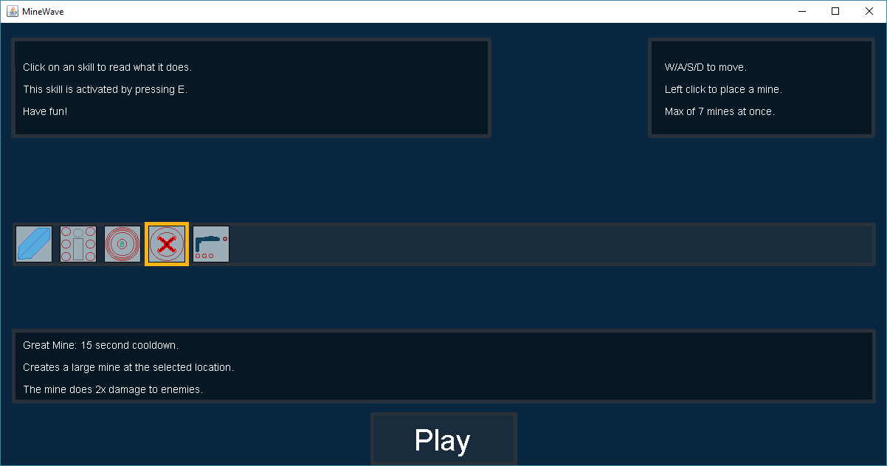
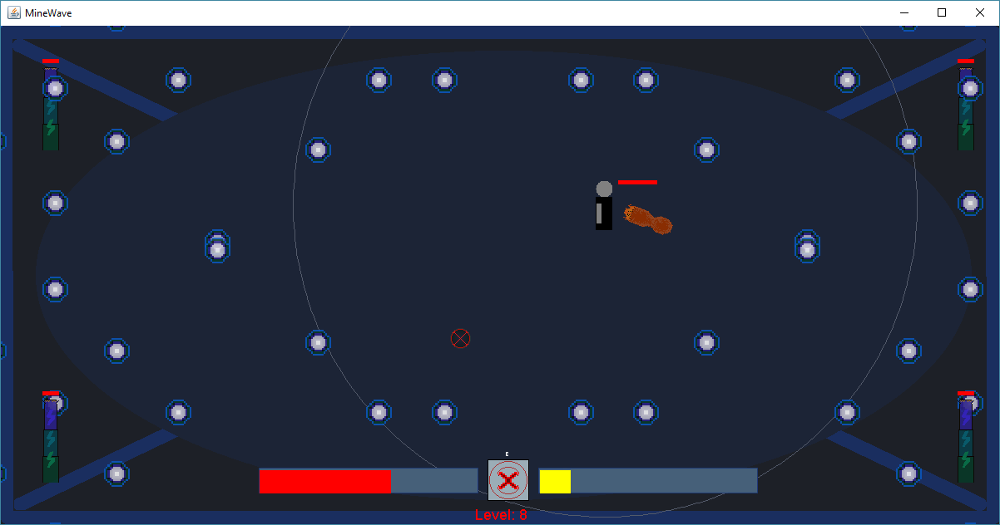
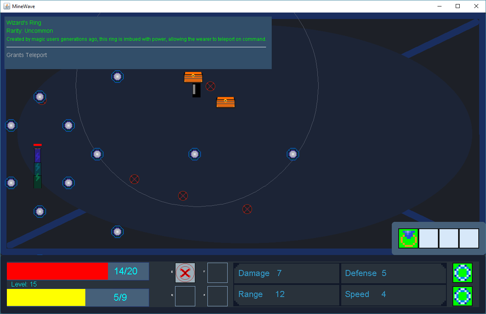
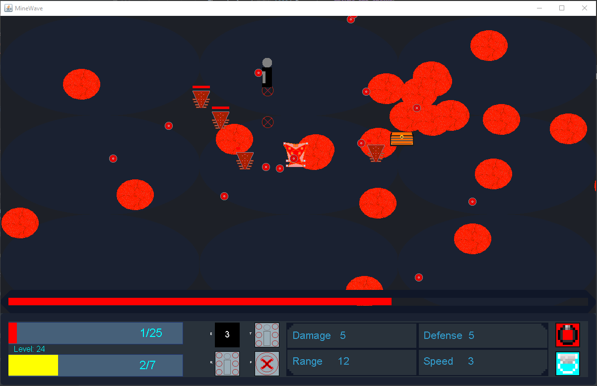
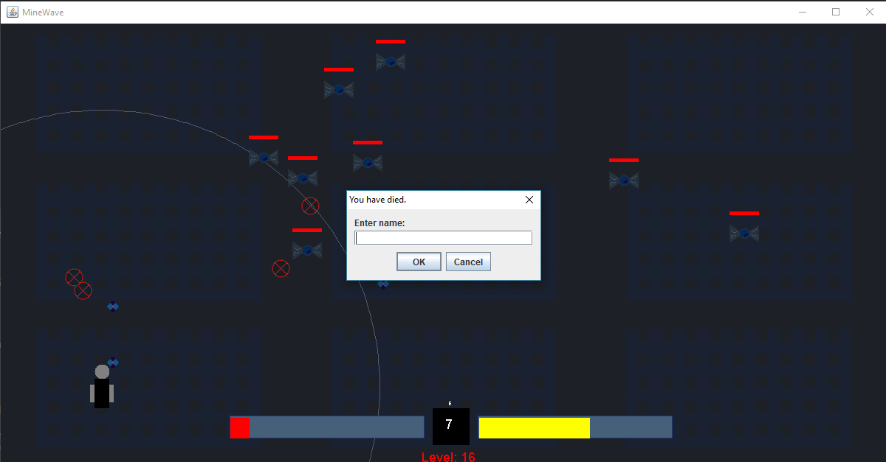
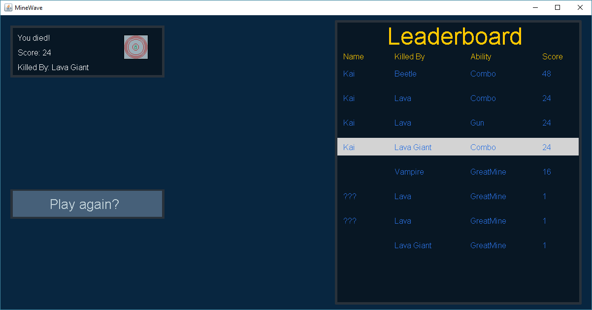

# MineWave

## Description:

Wave-based game with enemies progressing in difficulty, where the player must survive using abilities and mines.

>The older version of this game is no longer available to view.

## Features:

  - Wave based level generation.
  - Multiple enemy types.
  - A skill set used by both players and enemies.
  - Items that modify the player's gameplay.
  - Challenging periodic bosses.
  - An online leaderboard.

## Utilizes:

  - Java Swing

## Contributors:

  - Kai
  
## Screenshots:

